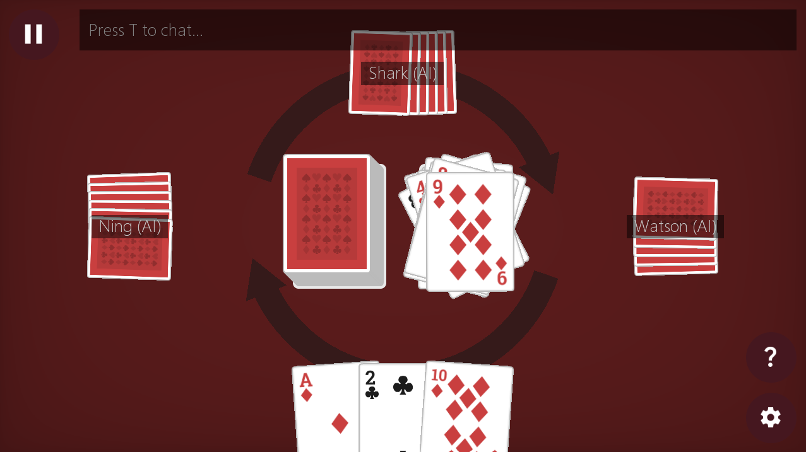

# Crazy Eights 1.0.0 alpha Pre-release!

Cross-platform online multiplayer Crazy Eights software made using [KTX](https://github.com/libktx/ktx). Available for **Windows**, **macOS**, **Linux** and **Android**! (Sorry iOS users :(, I don't have a Mac to build an iOS version, but you could build your own from source if you want to)

[Crazy Eights](https://en.wikipedia.org/wiki/Crazy_Eights) is a classic shedding card game which nowadays if you are familiar, is very similar to [UNO](https://en.wikipedia.org/wiki/Uno_(card_game)). In fact, UNO was created by the creator Merle Robbins just because he wanted to resolve an argument with his son about the rules of Crazy Eights! 

This application lets you play Crazy Eights either online with friends, or (if you don't have any friends) play locally with AIs. It features the classic rules, as well as rule variations using special cards. Currently supported special cards are **Draw Twos**, **Skips** and **Reverses**.

No pics no clicks!

## Features
- **Classic Crazy Eights gameplay!** With customizable rulesets
- **Multiplayer support!** Play together by joining rooms
- **Chat feature!**
- Synchronized cursors and card movements
- Cool shuffling and special card animations!
- Virtual table emulating the feel of sitting around a physical round table
- Sandbox like environment. You can freely move around cards on the table and rearrange cards in your hand

## Download

You can download the app [here](https://github.com/misterbander/crazy-eights/releases).

## Feedback

This project is created as part of my thesis. If you have any feedback, you can leave one at https://forms.office.com/r/LXrC4umeu3.

Thanks and have fun!
