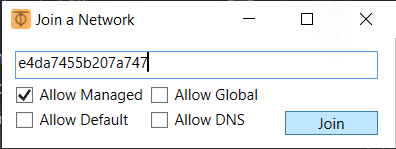

# Crazy Eights Multiplayer Guide

Crazy Eights supports multiplayer and allows players to host and join rooms and play together online. This section explains how to create and join a room.

You have two options. You could **play together in the same Local Area Network (LAN)**, or **play together over the Internet**.

## Playing Together in the Same LAN (i.e. same Wi-Fi)

If all players are playing together in the same LAN, then follow these 2 steps:

1. Choose a host to create a room with the "Create Room" option in the main menu. Note down the room code used to create the room, other players will need it to join. The room code can be changed if desired.

    

2. Other players can now join the room with the "Join Room" option in the main menu using the room code that was used to create the room.

    

## Playing Together Over the Internet

To play together over the Internet, more setup is needed. You could set up port forwarding, but a fast and easy way to connect is by using [ZeroTier](https://www.zerotier.com/). ZeroTier allows you to join networks that act just like LANs. I have set up a public ZeroTier network that you can join for convenience in testing sessions. It is **recommended** to create and join your own private ZeroTier networks. For more info, check out https://zerotier.atlassian.net/wiki/spaces/SD/pages/8454145/Getting+Started+with+ZeroTier

Every player including the host must have ZeroTier installed and have joined the same network.

### Windows
1) Go to https://www.zerotier.com/download/ to download and install ZeroTier.
2) Launch ZeroTier. A ZeroTier icon should appear in the system tray.

    
    

3) Right-click the ZeroTier system tray icon, and click "Join Network..."

    

4) In the window that pops out, type **e4da7455b207a747** (or your private ZeroTier network ID if joining a private ZeroTier network) in the text field. Leave the other options with their defaults, and click "Join".

    

### macOS

1) Go to https://www.zerotier.com/download/ to download and install ZeroTier.
2) Launch ZeroTier. A ⏁ icon should appear on your menu bar.
3) Click the ⏁ icon and select Join Network.
4) In the popup that appears, type **e4da7455b207a747** (or your private ZeroTier network ID if joining a private ZeroTier network) as the network ID field. Leave the other options with their defaults, and click "Join".

### Linux
1) Follow the instructions in https://www.zerotier.com/download/ to install ZeroTier for your Linux distribution.
2) Open a terminal, and type in the following command:

   `zerotier-cli join e4da7455b207a747`

    Or replace **e4da7455b207a747** with your own private ZeroTier network ID if joining a private ZeroTier network.

### Android
1) Download and install ZeroTier One from the Google Play Store: https://play.google.com/store/apps/details?id=com.zerotier.one
2) Launch ZeroTier One.
3) Tap the + button on the top right.

    

4) Enter **e4da7455b207a747** in the network ID field and tap "Add Network"

   

After all players have installed ZeroTier and connected to the same ZeroTier network, the host can now create a room and have other players join using the same room code as if they are in the same LAN by following the instructions in **Playing Together in the Same LAN**.

## Couldn't find room with room code: ******. Either the room code is incorrect, the server is not discoverable in your network, or the server failed to respond in time

When joining a room, the client attempts to find any rooms with matching room code in your network through multicast UDP discovery packets, which can be unreliable. If you are frequently encountering this error, and you are sure your room code is correct, you may try connecting with the advanced Join Room dialog.

This requires you to know the host machine's **IP address**. 

If players are using ZeroTier to connect, then ask the host to determine their ZeroTier IP address in the following way:

- On Windows, right-click the ZeroTier system tray icon and select "Show Networks". Then look for the field that says "Managed IPs". The number excluding everything after and including the slash is the IP address.

    
    

- On macOS, (WIP)
- On Linux, (WIP)

If you are joining your own private ZeroTier network, you can also see the host's ZeroTier IP address in the ZeroTier Central (https://my.zerotier.com/)

Once you get the host machine's IP address, open the join room dialog from the main menu, and click "Advanced" to show more options.

Enter the host machine's IP address in the Server IP Address field and the room code. You can now join the room by clicking "Join". 

